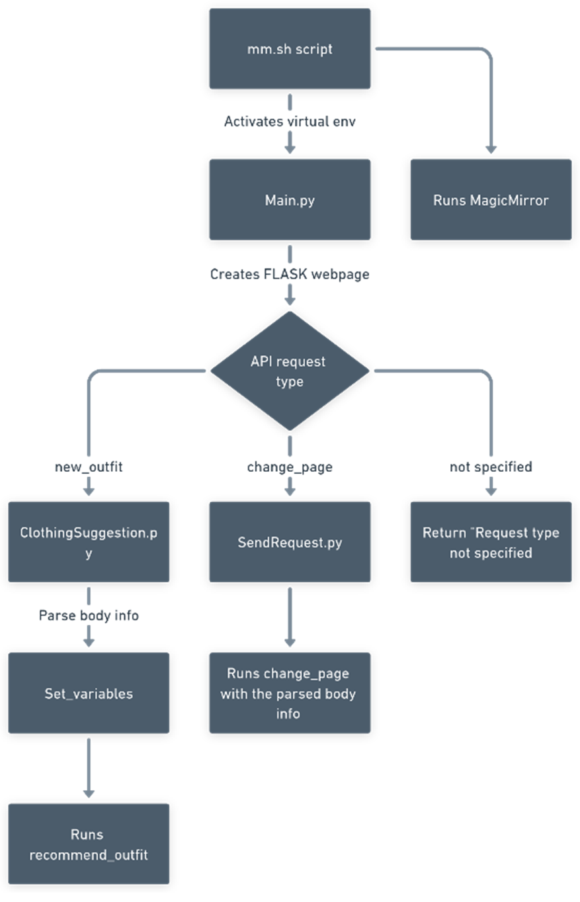

# 🪞 Smart Mirror – AI-Powered Clothing Assistant  
*Final Exam Project – Technology A – Vejle Technical Gymnasium*

> A semi-functional smart mirror prototype combining AI, voice control, outfit suggestions, and a modular display – built by a 4-person team and awarded **Grade 12 (highest possible in Denmark)**.

---

## 📸 Final Product – Mirror (Front and Back)

<div align="center">
  
  <br/>
  <em>Smart Mirror – Front view</em>
  <br/><br/>
  
  <br/>
  <em>Smart Mirror – Back view (electronics + Raspberry Pi)</em>
</div>

---

## 🚀 Overview

This project was our final exam for the *Technology A* subject in HTX (Vejle Technical Gymnasium).  
The goal was to build an **intelligent smart mirror** that could help users pick clothes efficiently, reduce unused wardrobe items, and provide a luxury-level, modern tech experience.

The system is divided into two main parts:

### 💻 PC (AI Assistant)
Due to hardware limitations on the Raspberry Pi, the AI voice assistant runs on a standard computer. It:
- Listens to the user through a GUI.
- Uses **Google Gemini Pro** to answer questions and the Neuralintents library to detect commands.
- Speaks back using **ElevenLabs Text-to-Speech**.
- Sends commands to the Raspberry Pi (like changing pages on the mirror).

### 🍓 Raspberry Pi (Smart Mirror + Control System)
The Raspberry Pi runs the **MagicMirror²** software, which displays time, weather, outfit images, and more. It also:
- Receives API commands from the AI assistant or mobile phone.
- Displays suggested outfits using a Flask-based interface and a custom image generator.

> ⚠️ Due to a limited project budget, we only had access to a **Raspberry Pi 3**, which could not handle the AI load. The AI was therefore offloaded to a PC. **With a Raspberry Pi 4 or 5, everything could have run directly on the Pi as originally intended.**

---

The mirror hardware itself was assembled using materials funded by the school. Since they covered all expenses, the final physical product was handed over after the exam. This project is no longer being developed, but the code remains available for educational purposes.


## 🧠 Key Features

- 🎤 **Voice Assistant (Runs on PC):**
  - Listens via a Tkinter interface with animated robot icon.
  - Uses **Google Gemini Pro** to generate answers.
  - Text-to-speech output with **ElevenLabs**.
  - Recognizes commands via a trained intent model (e.g. “change to music page”).

- 👕 **Outfit Suggestion Module (Raspberry Pi):**
  - Displays a random outfit collage generated from a filtered Kaggle dataset.
  - Saves the suggested outfit image to the folder displayed on the mirror.

- 📱 **Mobile/Web Control (Flask API):**
  - Runs locally on Raspberry Pi.
  - Allows page changes and interactions through a mobile app or remote interface.

---

## 💾 Installation & Usage

1. **Clone the repository:**
   ```bash
   git clone https://github.com/yourname/smart-mirror.git
   cd smart-mirror```


## 🧥 Outfit Dataset

The outfit suggestion system uses a cleaned version of the [Fashion Product Images Dataset](https://www.kaggle.com/datasets/paramaggarwal/fashion-product-images-small).

Due to file size, the images are not included in this repository.  
If you want to use your own dataset:

- Download the dataset via the link above.
- Place the image files in: Raspberry/ClothingSuggestion/Images/
- Ensure filenames match the ID in `clothing_dataset.csv`.

You can also modify the `clothing_dataset.csv` to match your custom image set.

---

## 🧩 MagicMirror² Setup

The smart mirror interface is powered by [MagicMirror²](https://github.com/MichMich/MagicMirror), a Node.js-based modular mirror framework.

### 🧱 Installed Modules and Their Purpose

As configured in our [config.js](https://github.com/JAQ0B/TechnologyProjekt-SmartMirror/blob/main/MagicMirror/config.js) :

- **MMM-Remote-Control** – Enables remote API control of MagicMirror.
- **MMM-pages** – Organizes the display into multiple pages with different layouts.
- **MMM-page-indicator** – Visual indicator showing which page is currently active.
- **MMM-weatherchart** – Shows a 24-hour weather forecast including precipitation, wind, and temperature.
- **MMM-YrThen** – Displays a 5-day weather forecast from Yr.no.
- **MMM-SimpleLogo** – Displays the recommended outfit image.
- **MMM-ImagesPhotos** – Shows static clothing images from the wardrobe.
- **MMM-OnSpotify** – Integrates Spotify to show current track, album art, and artist info.
- **MMM-LiveLyrics** – Displays live lyrics for the currently playing song on Spotify.

Additionally, we used 3 of MagicMirror’s default modules:
- **Clock**
- **Weather**
- **Calendar**

---

## 🔍 System Architecture

Below are simplified diagrams showing the software components split across the PC and Raspberry Pi.

<div align="center">

<br/>
<em>Software flow – PC (AI & voice control)</em>
<br/><br/>

<br/>
<em>Software flow – Raspberry Pi (Mirror control + Flask + Outfit display)</em>
</div>

---

## 📖 Final Report (in Danish)

The project was documented in a full 150+ page report for the final exam. It includes research, design decisions, budget, target audience analysis, technical development, and evaluation.

📄 [Download Teknologi A – Eksamensprojekt (PDF)](https://github.com/JAQ0B/TechnologyProjekt-SmartMirror/blob/main/Report/Teknologi%20A%20-%20Eksamensprojekt.pdf)

---

## 🔒 Disclaimer

This is a one-off prototype built for educational purposes.  
The school provided funding for materials and has retained ownership of the physical smart mirror.  
This repository and its contents will **not be further updated**.

---

## 📜 License

This project is released under the **MIT License**.  
See [LICENSE](./LICENSE) for more details.

---

## 👥 Authors

- Jacob Stahlfest Jørgensen  
- Max Hedeager Jensen  
- Rose Marie Bjerre  
- Lars Pedersen  

*Developed at Vejle Technical Gymnasium – Spring 2024*
